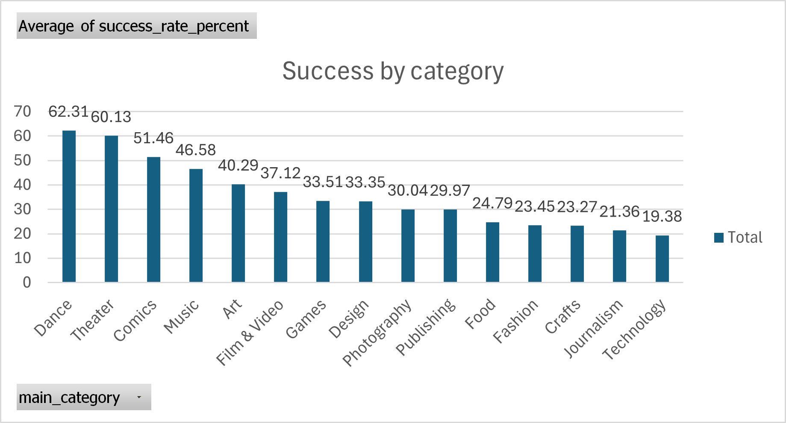
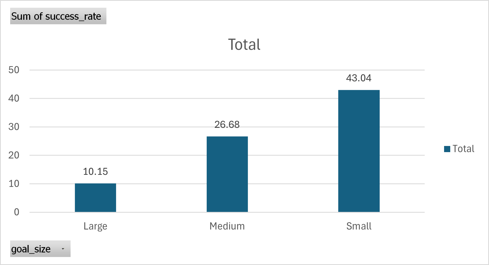
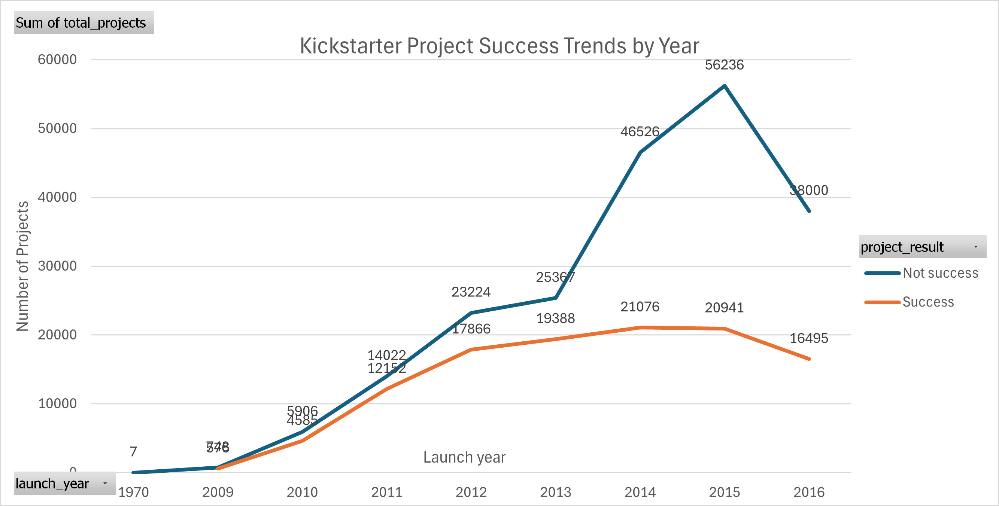

# Kickstarter SQL Analysis Using MySQL

Analyzing Kickstarter projects using SQL (Beginner Data Analysis Project)

## Kickstarter Project Analysis

This project analyzes Kickstarter campaigns to uncover patterns of success, examine the influence of funding goals, and identify trends across project categories over time. The dataset includes project category, funding goals, launch dates, pledged amounts, number of backers, and project outcomes.

## 1. Success by Main Category

I analyzed the average success rates for each Kickstarter category to see which types of projects tend to succeed:

| Main Category | Average Success Rate (%) |
|---------------|--------------------------|
| Dance         | 62.31                    |
| Theater       | 60.13                    |
| Comics        | 51.46                    |
| Music         | 46.58                    |
| Art           | 40.29                    |
| Film & Video  | 37.12                    |
| Games         | 33.51                    |
| Design        | 33.35                    |
| Photography   | 30.04                    |
| Publishing    | 29.97                    |
| Food          | 24.79                    |
| Fashion       | 23.45                    |
| Crafts        | 23.27                    |
| Journalism    | 21.36                    |
| Technology    | 19.38                    |

**Insights:**

-   Highest success rates: Dance (62%) and Theater (60%) — smaller, community-focused projects tend to perform better.
-   Moderate success: Comics (51%) and Music (47%) require strong fan engagement.
-   Lower success rates: Technology (19%) and Journalism (21%) — riskier categories with higher funding goals or niche audiences.

**Category Success Chart**

*Figure 1: Average success rate by main category.*

## 2. Funding Goals and Success

I analyzed how project funding goals affect the likelihood of success:

| Goal Size | Total Projects | Successful Projects | Success Rate (%) |
|----|----|----|----|
| Small (\< \$10,000) | 194,938 | 83,900 | 43.04 |
| Medium (\$10,000–\$50,000) | 100,030 | 26,684 | 26.68 |
| Large (\> \$50,000) | 24,593 | 2,495 | 10.15 |

**Insights:**

-   Smaller projects are significantly more likely to succeed.
-   Success rate drops sharply for medium and large goals.
-   Setting realistic and achievable goals is crucial for funding success.

**Funding Goal Success Chart**

*Figure 2: Success rate by funding goal size.*

## 3. Trends Over Time

I examined project launches over the years to identify patterns in success:

-   Kickstarter activity has increased steadily over time, with peaks reflecting platform popularity.
-   Early years had fewer projects but higher success rates.
-   More recent years show more projects and more competition, slightly lowering overall success percentages.

**Time Trend Chart**

*Figure 3: Time trend of successful Kickstarter projects.*

## Conclusion

From my analysis, I learned that:

-   **Category matters:** Dance, Theater, and Comics have the highest success rates, while Technology and Journalism are more challenging.
-   **Set achievable goals:** Smaller funding targets consistently perform better.
-   **Competition is increasing:** Strong campaign presentation, clear messaging, and engagement with backers are essential for success.

This analysis provides actionable guidance for planning future Kickstarter campaigns — from category selection and funding goals to designing campaigns that attract backers effectively.

## Technologies Used

-   **MySQL:** For data cleaning, importing CSVs, and running queries to calculate success rates, goal analysis, and trends.
-   **R:** For data analysis and editing documentation.
-   **Excel:** For creating charts and visualizations from query results.
-   **Git & GitHub:** To track project versions and host the repository online.
-   **Dataset:** The Kickstarter dataset used in this analysis is publicly available on Kaggle: <https://www.kaggle.com/datasets/kemical/kickstarter-projects>
